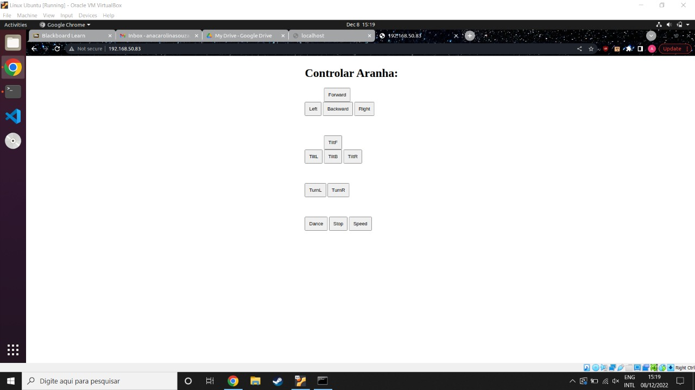
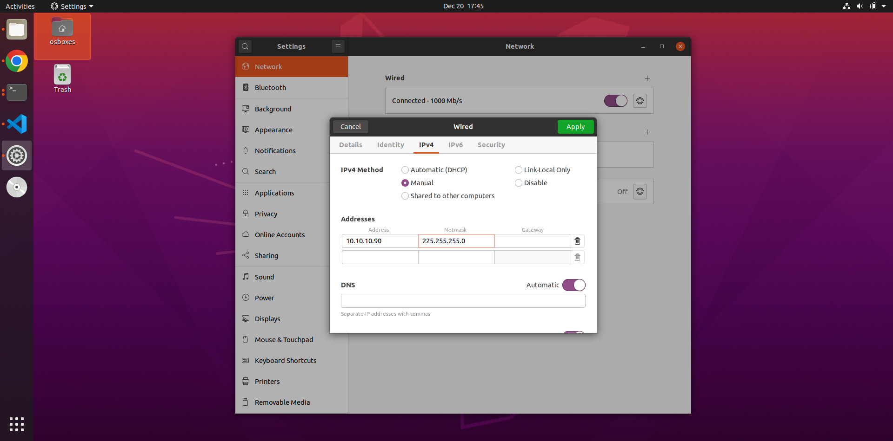
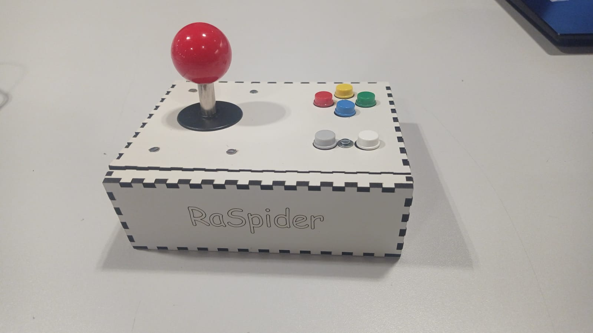

# RaSpider

- **Students:** Ana Carolina Souza and Kaique Dognani
- **Course:** Computer Engineering and Mecatronic Engineering
- **Semester:** 6th and 10th
- **Contact info:** anaclgs@al.insper.edu.br e kaiqued@al.insper.edu.br
- **Year:** 2022

----------------------------------------------

## Starting Out

In order to follow this tutorial, you will need:

- **Hardware:** Spider kit from Terasic, Raspberry Pi 4 Model B and ESP32
- **Softwares:** Visual Studio Code and Thonny
- **Base Code:** [Github](https://github.com/acsouza2398/Projeto_SoC_22b)
- **Documentation:** [DE10-Nano-SoC_User_manual.pdf](https://www.terasic.com.tw/attachment/archive/941/DE0-Nano-SoC_User_manual_rev.D0.pdf), [Raspberry Pi](https://www.raspberrypi.com/documentation/computers/)

----------------------------------------------

## Objective

This tutorial aims to take the Spider kit from Terasic and adapt the orignal code and hardware in order to control the robot's movements through a Flask server and Wi-fi using a Raspberry Pi acting an ethernet bridge and the ESP32 chip to make a controller.

----------------------------------------------

## First Steps

In order to setup the SDCard to act as our embedded Linux, please follow the tutorial at the subject's site: [Linux Embarcado](https://insper.github.io/Embarcados-Avancados/Tutorial-HPS-Running/). Once done, please continue with this guide.

### BuildRoot

As we will be using Flask to control the spider, there are a few modules that need to be activated in order for the server to run properly that aren't standard, such as Dropbear. 

Please follow the BuildRoot tutorial present at the subject's main site: [BuildRoot](https://insper.github.io/Embarcados-Avancados/Tutorial-HPS-Buildroot/). Stop before **8. Finalizando** and return here.

With the configuration menu still open, navigate over to Target Packages :arrow_right: Networking Applications and scroll down until you find Dropbear and enable it. Hit ++esc+esc++ until you return to the Target Packages menu and this time head over to Interpreter Languages and Scripting. Double check that python3 is enabled. If so, return to the BuildRoot tutorial and finish the compilation.

### Kernel

We don't need any special changes to the kernel configuration, so please follow the Kernel compilation tutorial from the subject's site: [Compilando o Kernel](https://insper.github.io/Embarcados-Avancados/Tutorial-HPS-Kernel/) and complete the sd card setup.

----------------------------------------------

## Booting Up

With the SDCard built with the specified configurations, insert it into the DE10-Nano-SoC board and boot it up. You will need to open a serial connection to the board through screens in order to setup a static ip to ssh into the board.

!!! tip
    How to open this connection is explained under the section **USB-UART** at [Linux Embarcado](https://insper.github.io/Embarcados-Avancados/Tutorial-HPS-Running/)

After you login to the board, you will need to create a script that will run whenever the board starts up to set the static ip chosen:

```
cd /etc/init.d
vi S60MAC.sh
```

Within this script, add the following:

``` py
case "$1" in
start)
    printf "Setting ip: "
    /sbin/ifconfig eth0 10.10.10.100 netmask 255.255.255.0 up
    [ $? = 0 ] && echo "OK" || echo "FAIL"
    ;; 
*)
    exit 1
    ;;
esac
```
!!! note
    Due to the future configuration of the Raspberry Pi, the ip chosen for this board is 10.10.10.100/24, but if you prefer, feel free to change the ip and the netmask to whatever suits your fancy.

Make the script executable by running ```chmod +x S60MAC.sh```.

----------------------------------------------

## Programing the Spider

The Terasic Spider Kit already comes with all archives and programs necessary for it to work according to the original project's specification. However, as this tutorial aims to control it with Wi-fi and not bluetooth, some trimming is necessary to remove the original bluetooth function and add in our chosen protocol of communication: a Flask server.

!!! info "Base Code"
    This tutorial has made the trimmed and adapted code available in the **Starting Out** section under _Base Code_.

### Explaining the Code

The code that was edited and will be compiled to the spider is ```main.cpp```, found within the folder ```TESTES_PARA_O_PROJETO```. This code has 2 separate parts: the socket setup and the processing of the commands received.

The socket setup consists of finding the chosen socket and listening on the specified port to bind and form a connection to the other half of the socket, which is the Flask server:

??? info "Socket Setup Code"
    ``` c
        int sock = 0, connfd = 0;
        char sendBuff[1025];
        char recvBuff[1025];
        memset(sendBuff, '0', sizeof(sendBuff));
        unlink(SOCKET_NAME);

        sock = socket(AF_UNIX, SOCK_STREAM, 0);

        struct sockaddr_un name;
        memset(&name, 0, sizeof(struct sockaddr_un));
        name.sun_family = AF_UNIX;
        strncpy(name.sun_path, SOCKET_NAME, sizeof(name.sun_path) - 1);
    
        bind(sock, (const struct sockaddr *) &name, sizeof(struct sockaddr_un));

        //Prepare for accepting connections.
        listen(sock, 20);
        connfd = accept(sock, (struct sockaddr*)NULL, NULL);
    ```

Once this connection is established, the program goes into an infinite loop awaiting commands in which it matches the message received with the switch case that is mapped out to the spider's movements and executes the matching command:

??? info "Spider Movement Processing"
    ``` c
        while (1)
	{
		int n = 0;
        if ((n = read(connfd, recvBuff, sizeof(recvBuff)-1)) > 0) {
            recvBuff[n] = 0;
			printf(recvBuff);
			int comando = atoi(recvBuff);
			switch (comando)
			{
			case CMD_FORWARD:
				printf("CMD_FORWARD\n");
				Spider.MoveForward(1);
				break;
			case CMD_BACKWARD:
				printf("CMD_BACKWARD\n");
				Spider.MoveBackward(1);
				break;
			case CMD_TURN_RIGHT:
				printf("CMD_TURN_RIGHT\n");
				Spider.RotatelRight(1);
				break;
			case CMD_TURN_LEFT:
				printf("CMD_TURN_LEFT\n");
				Spider.RotatelLeft(1);
				break;
			case CMD_TILTL:
				printf("CMD_TILTL\n");
				Spider.TiltLeft();
				break;
			case CMD_TILTR:
				printf("CMD_TILTR\n");
				Spider.TiltRight();
				break;
			case CMD_TILTF:
				printf("CMD_TILTF\n");
				Spider.TiltForward();
				break;
			case CMD_TILTB:
				printf("CMD_TILTB\n");
				Spider.TiltBackward();
				break;
			case CMD_TILTN:
				printf("CMD_TILTN\n");
				Spider.TiltNone();
				break;
			case CMD_STOP:
				printf("CMD_STOP\n");
				Spider.Reset();
				break;
			case CMD_SPEED:
				printf("CMD_SPEED %d \n", Param);
				Spider.SetSpeed(Param);
				break;
			case CMD_TURN_LEFT_DGREE:
				printf("CMD_TURN_LEFT_DGREE %d \n", Param);
				break;
			case CMD_TURN_RIGHT_DGREE:
				printf("CMD_TURN_RIGHT_DGREE %d \n", Param);
				break;
			case CMD_Query_Version:
				printf("CMD_Query_Version\n");
				break;
			case CMD_JOYSTICK:
				printf("CMD_JOYSTICK (Param=%d)\n", Param);
				break;
			case CMD_ALL:
				printf("CMD_ALL\n");
				Spider.DEMO_Dance(1);
				QueueCommand.Clear();
				break;
			default:
				printf("Nothing\n");
				break;
			} // switch
			
        }
    ```

If no further modifications are necessary, compile using the Makefile provided by running ```make``` within the folder. The output file will be called ```spider``` and is one of the 2 files that will be moved to the board.

### Flask Server

In order to run our server, we will be using a python program running Flask to connect to the socket and build the webserver. The landing page is a very simple thing consisting of a handful of buttons that when clicked post the corresponding command number, which is then sent back to the C file running and making the spider move:



The python file, called ```main.py```, that's running the server connects to the socket setup previously and every POST gets sent over through the connection. All that's needed to define is the route that each button will take and what to do once they are pressed:

??? info "Flask Python Program"
    ``` py
    from flask import Flask, render_template, request
    app = Flask(__name__)

    import socket

    host = "/tmp/9Lq7BNBnBycd6nxy.socket"

    sock = socket.socket(socket.AF_UNIX, socket.SOCK_STREAM)
    sock.connect((host))

    @app.route("/", methods=['GET', 'POST'])
    def index():
        if request.method == "POST":
            print("post")
            if request.form['command'] == 'Forward':

                sock.sendall(bytes('1', "utf-8"))

            elif request.form['command'] == 'Backward':

                sock.sendall(bytes('2', "utf-8"))

            elif request.form['command'] == 'Right':

                sock.sendall(bytes('3', "utf-8"))

            elif request.form['command'] == 'Left':

                sock.sendall(bytes('4', "utf-8"))
            
            elif request.form['command'] == 'TiltL':

                sock.sendall(bytes('9', "utf-8"))

            elif request.form['command'] == 'TiltR':

                sock.sendall(bytes('10', "utf-8"))

            elif request.form['command'] == 'TiltF':

                sock.sendall(bytes('11', "utf-8"))

            elif request.form['command'] == 'TiltB':

                sock.sendall(bytes('12', "utf-8"))

            elif request.form['command'] == 'Stop':

                sock.sendall(bytes('7', "utf-8"))

            elif request.form['command'] == 'Dance':

                sock.sendall(bytes('16', "utf-8"))

        return render_template('pagina.html')
    ```

This along with the landing page in html are available within the folder ```FlaskFiles``` of the base code. This folder is the second piece that will need to be sent over to the spider.
<<<<<<< HEAD

### Sending the Files Over

In order to send the necessary files over to the board of the spider, we will make use of scp, which works similarly to ssh. However, this requires that the board and your computer are on the same subnet. This tutorial has already placed a fixed ip for the board, so all that is needed is to configure a static ip address for your computer.

Connect one end of an ethernet cable to your board and the other end to a USB-Ethernet adapter, which will then plug into your computer. Open up your computer's network settings, head over to **Wired Connection** :arrow_right: **IPv4** and configure your ip and netmask:



!!! note
    This ip address and netmask are on the same subnet as the board, which was configured earlier. If you chose a different address, you will need to adjust your computer's address on this step to match.

Once the configuration is applied, you can test the connection by pinging the board from your computer. If you've managed to ping, you're good to move on. Otherwise, check your configurations both on the board through a serial connection and on the computer.

Navigate over to where ```/.spider``` is located on your computer and run the following command:

``` 
scp spider root@10.10.10.100:/root/
```

Next, go to where your folder with the Flask files is and run scp again, but this time with the -r flag to send the whole folder along:

```
scp -r /FlaskFiles root@10.10.10.100:/root/
```

With both commands succeeding, your Spider and Flask system is now ready.

----------------------------------------------

## Running the Programs

With the ethernet cable still connected, access the board through ssh:

```
ssh root@10.10.10.100
``` 

Once inside, run ```ls``` and verify that the two items you sent over are there. If they are, you can start up the socket by running:

```
.spider &
cd FlaskFiles
python3 main.py
```

Wait for the server to go up, and once it does, you can access the landing page shown earlier by opening a browser and navigating to ```localhost:80```. Test the connection by clicking on one of the buttons. If the spider responds, you've done it!

## Automating on Boot

As it stands, every time that you want to run the program, you need to ssh into the board and manually run both programs. There is an easier way to run them: by making them run as soon as the board boots up.

We will be using the same script that was used to set up the static ip. As such, open up the script:

```
vi /etc/init.d/S60MAC.sh
```

And edit the script:

```
#!/bin/bash

case "$1" in
start)
    printf "Setting ip: "
    /sbin/ifconfig eth0 10.10.10.100 netmask 255.255.0.0 up
    [ $? = 0 ] && echo "OK" || echo "FAIL"
    ./root/spider &
    python /root/FlaskFiles/main.py &
    ;; 
*)
    exit 1
    ;;
esac
```

Make it executable with ```chmod +x S60MAC.sh``` and the programs will run every time it boots up.

----------------------------------------------

## Adding Wi-fi

=======

### Sending the Files Over

In order to send the necessary files over to the board of the spider, we will make use of scp, which works similarly to ssh. However, this requires that the board and your computer are on the same subnet. This tutorial has already placed a fixed ip for the board, so all that is needed is to configure a static ip address for your computer.

Connect one end of an ethernet cable to your board and the other end to a USB-Ethernet adapter, which will then plug into your computer. Open up your computer's network settings, head over to **Wired Connection** :arrow_right: **IPv4** and configure your ip and netmask:


!!! note
    This ip address and netmask are on the same subnet as the board, which was configured earlier. If you chose a different address, you will need to adjust your computer's address on this step to match.

Once the configuration is applied, you can test the connection by pinging the board from your computer. If you've managed to ping, you're good to move on. Otherwise, check your configurations both on the board through a serial connection and on the computer.

Navigate over to where ```/.spider``` is located on your computer and run the following command:

``` 
scp spider root@10.10.10.100:/root/
```

Next, go to where your folder with the Flask files is and run scp again, but this time with the -r flag to send the whole folder along:

```
scp -r /FlaskFiles root@10.10.10.100:/root/
```

With both commands succeeding, your Spider and Flask system is now ready.

----------------------------------------------

## Running the Programs

With the ethernet cable still connected, access the board through ssh:

```
ssh root@10.10.10.100
``` 

Once inside, run ```ls``` and verify that the two items you sent over are there. If they are, you can start up the socket by running:

```
.spider &
cd FlaskFiles
python3 main.py
```

Wait for the server to go up, and once it does, you can access the landing page shown earlier by opening a browser and navigating to ```localhost:80```. Test the connection by clicking on one of the buttons. If the spider responds, you've done it!

## Automating on Boot

As it stands, every time that you want to run the program, you need to ssh into the board and manually run both programs. There is an easier way to run them: by making them run as soon as the board boots up.

We will be using the same script that was used to set up the static ip. As such, open up the script:

```
vi /etc/init.d/S60MAC.sh
```

And edit the script:

```
#!/bin/bash

case "$1" in
start)
    printf "Setting ip: "
    /sbin/ifconfig eth0 10.10.10.100 netmask 255.255.0.0 up
    [ $? = 0 ] && echo "OK" || echo "FAIL"
    ./root/spider &
    python /root/FlaskFiles/main.py &
    ;; 
*)
    exit 1
    ;;
esac
```

Make it executable with ```chmod +x S60MAC.sh``` and the programs will run every time it boots up.

----------------------------------------------

## Adding Wi-fi

>>>>>>> c3961ca6c6aed38fa721d8e01a488dcf44754e1a
However, this is hardly what was promised in the begining. In order to get a wireless experience, you will need to set up an ethernet forwarding bridge through a Raspberry Pi. This is because the linux kernel that is compatible with the spider program cannot support popular Wi-fi modules, so we need a way around this to make it wireless. You can either use an older Pi with a Wi-fi dongle or a new model with Wi-fi built-in. This tutorial will be using the Raspberry Pi 4 model B, which has the module built-in.

### First Steps

The first thing to do will be to program a SDCard with a clean Raspian image with ssh enabled and configured with access to your Wi-fi network.

!!! tip
    If you have never done so, please follow the guide at [Raspberry Pi - Getting Started](https://www.raspberrypi.com/documentation/computers/getting-started.html#installing-the-operating-system)

Once your Raspberry Pi is up and running, you have two ways to access it: via ssh or using a monitor, mouse and keyboard. The first option is good if you have admin access to your router and can check which ip address was assigned to it. Should you be in a situation which that isn't possible, you will need to connect a monitor, mouse and keyboard to access the board like a normal computer.

### Configuring the Bridge

With access to the Raspberry Pi, we can begin configuring the ethernet bridge.

The first thing to do is update it by running:
```
sudo apt update
sudo apt upgrade
```

The bridge will work by setting up a firewall which will forward all requests inbound and outbound to the ethernet port and, therefore, to our spider. To do so, we will make use of dnsmasq and iptables:
```
sudo apt-get install dnsmasq iptables
```

With both installed, we need to configure a static ip to the ethernet port, much like was done with your computer earlier. This will be done by modifying the DHCPCD configuration file:
```
sudo nano /etc/dhcpcd.conf
```

Add the following to the file:
```
interface eth0
static ip_address=10.10.10.1/24
static routers=10.10.10.0
```

This ensures that the ethernet port will be on the same subnet as the board, which was chosen in the beginning of this tutorial. To make these changes take place, we need to restart DHCPCD:
```
sudo service dhcpcd restart
```

You can verify if the changes have occured by running ```ifconfig```. If ```eth0``` has the correct ip address, then the configuration has stuck.

The next step is to set up the firewall. First we need to inform it how to process DNS and DHCP traffic at our port. To do so, we need to adjust the configuration file for DNSMasq:

```
sudo nano /etc/dnsmasq.conf
```

Add the following lines to the file:

```
interface=eth0       # Use interface eth0  
listen-address=10.10.10.1   # Specify the address to listen on  
bind-dynamic         # Bind to the interface
server=8.8.8.8       # Use Google DNS  
domain-needed        # Don't forward short names  
bogus-priv           # Drop the non-routed address spaces.  
dhcp-range=10.10.10.2,10.10.10.150,12h # IP range and lease time  

```

!!! info "DNS and DHCP"
    If you want to learn more about this kind of traffic, please check [this](https://www.univention.com/blog-en/brief-introduction/2019/03/brief-introduction-dhcp-dns/#:~:text=DHCP%20and%20DNS%20are%20two,be%20found%20by%20their%20names.) out.

In order to enable the forwarding, we need to modify ```sysctl.conf``` file to allow it:

```
sudo nano /etc/sysctl.conf
```

Find ```#net.ipv4.ip_forward=1``` and remove the **#** from the beginning. Save and exit the file. This configuration will only hold true once you reboot the system, but to avoid doing so, we can locally enable it for right now:

```
sudo sh -c "echo 1 > /proc/sys/net/ipv4/ip_forward"
```

With the protocol configured, we can configure the rules to the firewall through iptable rules. Run the following commands:
```
sudo iptables -t nat -A POSTROUTING -o wlan0 -j MASQUERADE
sudo iptables -A FORWARD -i wlan0 -o eth0 -m state --state RELATED,ESTABLISHED -j ACCEPT  
sudo iptables -A FORWARD -i eth0 -o wlan0 -j ACCEPT
```

!!! note
    If you get errors when running these commands, run ```sudo reboot``` and try again.

These rules make every thing arriving and leaving the wlan0 connection to be sent to the eth0 connection, which is the ethernet bridge. However, iptables are wiped upon reboot. To avoid having to reconfigure them every time, you can automate it upon the boot, much like was done with the spider. 

First things first, we need to save the current rules to a file:
```
sudo sh -c "iptables-save > /etc/iptables.ipv4.nat"
```

Next up, we need to have this file run upon boot. This can be done by editing ```rc.local```

```
sudo nano /etc/rc.local
```

Locate ```exit 0``` and insert ```iptables-restore < /etc/iptables.ipv4.nat``` right above it. Save and exit the file.

With all the configurations in place, we can start up the service with:
```
sudo service dnsmasq start
```

Now you can connect your spider through ethernet to the Raspberry Pi. Through the Raspberry, try to ping the spider using the static ip defined earlier. If you succeeded, the final step of connecting your computer to this system can begin.

### Connecting your Computer

Back on your computer, the first thing is to make sure that you are on the same Wi-fi network as the Raspberry Pi. Make sure you can ping it from your computer. If you've succeeded, the next thing to do is open a ssh tunnel through the Raspberry Pi to the spider using the port 8080:

```
ssh pi@192.168.0.167 -L 8080:10.10.10.100:80
```

To check if the tunnel went through, open a browser and access ```localhost:8080```. If you can see the spider's landing page, then you've succeeded. If not, try to ping the spider through the Raspberry Pi and check if the Flask Server is running.

The final step to make the server accessible to all devices on the Wi-fi network is to use **socat**. This module does port-forwarding, meaning that any device that pings your computer at a certain port, in this case 8000, will be redirected to somewhere else: ```localhost:8080```, the address where the ssh tunnel is open. This way, your computer is acting like a NAT forwarder to the Raspberry Pi, which in turn, is forwarding the connection to the spider through ethernet.

Install **socat** with: ```sudo apt-get install socat``` and run the command to allow the forwarding:

```
socat TCP-LISTEN:8000,fork TCP:127.0.0.1:8080
```

To check if the whole system is working, get another device on the same network and access ```[computer_ip]:8000``` on a browser. If you can see the spider's landing page and control it through the buttons, then we've achieved the objective of this tutorial. 

!!! note
    In order for the system to keep working, the two terminals with the ssh tunnel and socat command need to stay open and running on the computer. If they ever crash or go down, you will need to run them again and the connection will be restored. 

----------------------------------------------

## Building a Controller

Now that any device connected to the same network can control the spider, we can ditch the landing page and make something more intuitive to control the spider: a joystick controller.



This controller was made using 6 buttons and a joystick controller made up of 4 more buttons as inputs and a ESP32 chip to process the signals and post the results to the Flask file through the tunnel opened in the last step.

The ESP32 code was made in micropython. It first connects to the Wi-fi network chosen, configures all the pins to each button and processes each signal in the same way as ```main.py``` does for the buttons in the landing page.

??? info "ESP32 Program"
    This is also available in the base code provided under the name ```Codigo_ESP32.py```.

    ``` py
    import network
    import urequests as requests
    from machine import Pin
    from time import sleep

    print("Inicializando o módulo wifi")

    PinLed = Pin(2, Pin.OUT, value=0)

    print("Conectando na rede...")

    station = network.WLAN(network.STA_IF)
    station.active(False)
    sleep(1)
    station.active(True)
    sleep(1)
    station.connect('meuwifo', 'kkkkeaimen')
    while(not station.isconnected()):
        pass


    print("Conectou!")

    def SendDir(direction):
        r = requests.get(
                            "http://192.168.39.35:8000/esp_route",
                            json={ "move": direction }
                        )
        print(r.status_code, r.text)
        r.close()

    print("Inicializando pinos")

    botForward  = Pin(16, Pin.IN, Pin.PULL_UP)
    botBackward = Pin(17, Pin.IN, Pin.PULL_UP)
    botRight    = Pin(18, Pin.IN, Pin.PULL_UP)
    botLeft     = Pin(19, Pin.IN, Pin.PULL_UP)
    botTiltL    = Pin(21, Pin.IN, Pin.PULL_UP)
    botTiltR    = Pin(22, Pin.IN, Pin.PULL_UP)
    botTiltF    = Pin(23, Pin.IN, Pin.PULL_UP)
    botTiltB    = Pin(25, Pin.IN, Pin.PULL_UP)
    botStop     = Pin(26, Pin.IN, Pin.PULL_UP)
    botDance    = Pin(27, Pin.IN, Pin.PULL_UP)


    print("Inicio do loop infinito")
    PinLed.on()
    gc.enable()
    gc.collect()
    while (True):
        if   not botForward.value():
            print('Forward')
            SendDir('Forward')
            gc.collect()
        elif not botBackward.value():
            print('Backward')
            SendDir('Backward')
            gc.collect()
        elif not botRight.value():
            print('Right')
            SendDir('Right')
            gc.collect()
        elif not botLeft.value():
            print('Left')
            SendDir('Left')
            gc.collect()
        elif not botTiltL.value():
            print('TiltL')
            SendDir('TiltL')
            gc.collect()
        elif not botTiltR.value():
            print('TiltR')
            SendDir('TiltR')
            gc.collect()
        elif not botTiltF.value():
            print('TiltF')
            SendDir('TiltF')
            gc.collect()
        elif not botTiltB.value():
            print('TiltB')
            SendDir('TiltB')
            gc.collect()
        elif not botStop.value():
            print('Stop')
            SendDir('Stop')
            gc.collect()
        elif not botDance.value():
            print('Dance')
            SendDir('Dance')
            gc.collect()
    ```

Compile this program onto your ESP32 using your preferred micropython interpreter (this tutorial used **Thonny**) and connect your pins to the buttons and your controller should be ready.

There is one final modification necessary to the flask files in order for the controller to work. The ESP32 is using a more simplified protocol to post the button information, so it needs its own route to post different from the landing page:

``` py
@app.route("/esp_route", methods=['GET'])
def esp_route():
    DATA = request.get_json(force=True)
    respDir = DATA['move']
    
    if   respDir == 'Forward':   sock.sendall(bytes('1', "utf-8"))
    elif respDir == 'Backward':  sock.sendall(bytes('2', "utf-8"))
    elif respDir == 'Right':     sock.sendall(bytes('3', "utf-8"))
    elif respDir == 'Left':      sock.sendall(bytes('4', "utf-8"))
    elif respDir == 'TiltL':     sock.sendall(bytes('9', "utf-8"))
    elif respDir == 'TiltR':     sock.sendall(bytes('10', "utf-8"))
    elif respDir == 'TiltF':     sock.sendall(bytes('11', "utf-8"))
    elif respDir == 'TiltB':     sock.sendall(bytes('12', "utf-8"))
    elif respDir == 'Stop':      sock.sendall(bytes('7', "utf-8"))
    elif respDir == 'Dance':     sock.sendall(bytes('16', "utf-8"))
    else: return "error", 500
    
    return "OK", 200
```

!!! tip
    The file in the base code already has this route added, so no need to edit anything. 

----------------------------------------------

## Next Steps

The next steps to progress this project would be to move the forwarding off the computer and make it work exclusively on the Raspberry Pi through NAT forwarding on iptables. This would require more knowledge on routers and subnets, as well as NAT rules and firewalls.

If you would like to learn more, RedHat has extensive documentation about [this](https://access.redhat.com/documentation/en-us/red_hat_enterprise_linux/4/html/security_guide/ch-fw).

----------------------------------------------

## Motivation
<<<<<<< HEAD

Our motivation to start this project was because when we saw that the Spider could only be controlled through a simple app on one phone through Bluetooth, we figured that making it controllable through Wi-fi and by any device on the network would be a simple and reasonable next step to improve upon the project. What started out as a simple project, "how to control a robotic spider through Flask" evolved several times to reach this final version because everytime we reached an objective, we would add a new goal to keep pushing and seeing how far we could go. We went through several attempts and several modules and methods until we landed on the process you just read through. Although not everything we tried out worked, we did learn a lot through trial and error and we hope that someone in the future can see what we've managed to achieve and improve upon it and make it go farther than we considered or even tried.

----------------------------------------------

## References
 - [Subject's main site](https://insper.github.io/Embarcados-Avancados/)
 - [Easy Raspberry Pi WiFi Bridge](https://pimylifeup.com/raspberry-pi-wifi-bridge/#:~:text=A%20Raspberry%20Pi%20WiFi%20bridge,through%20your%20Pi%20without%20issues)
 - [Raspberry Pi Documentation](https://www.raspberrypi.com/documentation/computers/getting-started.html#installing-the-operating-system)
 - [Flask](https://flask.palletsprojects.com/en/2.2.x/)
 - [Red Hat Firewall](https://access.redhat.com/documentation/en-us/red_hat_enterprise_linux/4/html/security_guide/ch-fw)
=======

Our motivation to start this project was because when we saw that the Spider could only be controlled through a simple app on one phone through Bluetooth, we figured that making it controllable through Wi-fi and by any device on the network would be a simple and reasonable next step to improve upon the project. What started out as a simple project, "how to control a robotic spider through Flask" evolved several times to reach this final version because everytime we reached an objective, we would add a new goal to keep pushing and seeing how far we could go. We went through several attempts and several modules and methods until we landed on the process you just read through. Although not everything we tried out worked, we did learn a lot through trial and error and we hope that someone in the future can see what we've managed to achieve and improve upon it and make it go farther than we considered or even tried.
>>>>>>> c3961ca6c6aed38fa721d8e01a488dcf44754e1a
